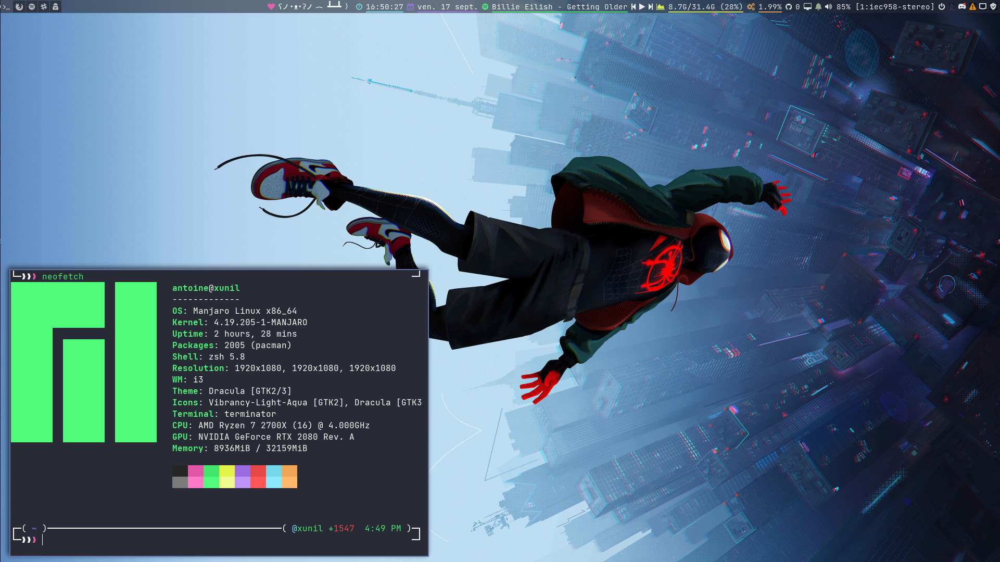

[![Contributors][contributors-shield]][contributors-url]
[![Forks][forks-shield]][forks-url]
[![Stargazers][stars-shield]][stars-url]
[![Issues][issues-shield]][issues-url]
[![MIT License][license-shield]][license-url]
[![LinkedIn][linkedin-shield]][linkedin-url]
[![Twitter][twitter-shield]][twitter-url]

<br />
<p align="center">
  <a href="https://github.com/aneveux/dotfiles">
    
  </a>

  <h3 align="center">🦕 Antoine`.`files </h3>

  <p align="center">
    Personal dotfiles repository of <a href="https://twitter.com/antoineneveux">Antoine</a>, provisioned by <a href="https://www.ansible.com/">Ansible</a>.
  </p>
</p>

<details open="open">
  <summary><h2 style="display: inline-block">Table of Contents</h2></summary>
  <ol>
    <li>
      <a href="#about-the-project">About The Project</a>
      <ul>
        <li><a href="#built-with">Built With</a></li>
      </ul>
    </li>
    <li>
      <a href="#using">Using</a>
      <ul>
        <li><a href="#prerequisites">Prerequisites</a></li>
        <li><a href="#installation">Installation</a></li>
      </ul>
    </li>
    <li><a href="#usage">Usage</a></li>
    <li><a href="#roadmap">Roadmap</a></li>
    <li><a href="#contributing">Contributing</a></li>
    <li><a href="#license">License</a></li>
    <li><a href="#contact">Contact</a></li>
    <li><a href="#acknowledgements">Acknowledgements</a></li>
  </ol>
</details>

## About The Project

Hello World 👋

This repository is *yet another dotfiles repository*, containing all the things I'm using to bootstrap and configure my development environment.

There's nothing too crazy in it, except things making my life easier, and a bunch of stuff I installed at some point and forgot why. Quite a lot of things are inspired from various dotfiles projects I found here and there, and I'll try my best to credit all the references I used at the end of that README.

There were numerous versions of my dotfiles, using various tools and provisioning mechanisms. I tried lots of different things, from window managers to shells, but this current version is probably the one I've been comfortable with for the longest time, and it's been around 3 years of me using it I believe.

If you'd like to setup your environment with that project, feel free to use it. I would highly recommand taking a bit of time to understand it and adapt it to your needs though, to avoid hurting your computer too much. Of course if you have questions about something in that project and would like to talk about it, feel free to message me 😀

Have fun!

### Using

Here's what my desktop looks like:

<p align="center">
  
</p>

I'm using [Manjaro](https://manjaro.org/) as my main operating system for years now. My window manager is [i3-gaps](https://github.com/Airblader/i3), a fork of [i3wm](https://i3wm.org/).

To complete my desktop environment, I'm using [i3blocks](https://vivien.github.io/i3blocks/) to manage my status bar, [Rofi](https://github.com/davatorium/rofi) as my application launcher, [Dunst](https://dunst-project.org/) for managing notifications.

I'm using [zsh](https://www.zsh.org/), nowadays completed by [Prezto](https://github.com/sorin-ionescu/prezto) (after years of using [oh-my-zsh](https://ohmyz.sh/)).

Almost everything is using the [Dracula theme](https://draculatheme.com/), but I tend to change it once in a while.

And you'll find plenty of other things here and there in that repository, from the code editors I use to some helpful programs I find interesting.

Don't hesitate to let me know if you'd have any recommendation to make!

## Getting Started

All of my dotfiles are managed with [Ansible](https://www.ansible.com/), allowing me to provision multiple environments and customize what's being deployed if necessary.

Configuration can be done through a yml file overriding the default values of this repository.

The `install.sh` script provided at the root of this repository allows you to execute the ansible commands easily.

### Prerequisites

Ansible tasks will most of the time automatically install software requirements, but there are a few things you need to install beforehand, like `ansible` itself for example, or `git` to retrieve that repository.

Some tools will be installed from the [aur](https://aur.archlinux.org/). We'll need an Ansible module in order to ease the installation for us, so we'll use [Ansible AUR](https://github.com/kewlfft/ansible-aur). It can use lots of AUR clients. I'm using [yay](https://github.com/Jguer/yay) myself, which is easy to install.

If you want to follow the way I do, I simply install `yay`, then use `yay` in order to install ansible-aur with `yay -S ansible-aur-git`.

With `yay`, `ansible`, and `ansible-aur` installed, you're ready to use the playbooks to start bootstraping your environment.

### Installation

After checking that the repository contains what you want, you can:

1. Create a local configuration file at `local/local.yml` (this repository assumes your dotfiles are located at `~/dotfiles`)

The content of this local configuration file should look like:

```yml
---
usr:
  id: john_doe
  name: John Doe
  mail: john@doe.org
  gpg_key: ABCDEFXXXXX
  preferences:
    shell: /usr/bin/zsh
    xsession: i3
    keymap: fr
    locales:
      - "en_US.UTF-8"
    multiscreen: True
    laptop: True

sys:
  proxy:
    enabled: False
    host: none
    port: 0
    noproxy: none
  preferences:
    sudo_nopassword: yes
```

2. Customize the configuration the way you like
3. Execute the `install.sh` script

The script will let you install everything, or select exactly what you'd like to provision tool by tool.

If you want to install everything, simply run `./install.sh all`, otherwise, you can simply write the tag of a component you'd like to install, like `./install.sh i3` for example.

## Usage

The `install.sh` script allows you to provision everything you need. Roles are supposed to be idempotent, so you can execute them multiple times and nothing will change if their content has already been applied.

If you were about to use that repository for yourself, I'd highly recommend you to fork the repository, and modify it accordingly with your preferences.

## Roadmap

See the [open issues](https://github.com/aneveux/dotfiles/issues) for a list of proposed features (and known issues).

## Contributing

This project really is my setup for my development environment, so it's not that much a perfect fit for external contributions.

But if you have any recommendations, or if you see any bugs that could be fixed, feel free to let me know.

## License

Distributed under the MIT License. See `LICENSE` for more information.

## Contact

Antoine Neveux - [@antoineneveux](https://twitter.com/antoineneveux) - aneveux `at` protonmail `dot` com

Project Link: [https://github.com/aneveux/dotfiles](https://github.com/aneveux/dotfiles)

## Acknowledgements

### Ansible Resources

- [Ansible AUR](https://github.com/kewlfft/ansible-aur)

### Themes

- [Dracula Theme](https://draculatheme.com/) (*which I used for almost everything*)
- [Pywal](https://github.com/dylanaraps/pywal/) (*which I'm trying once in a while when needing a change*)

### Zsh Stuff

- [prezto](https://github.com/sorin-ionescu/prezto)

### Dotfiles inspiration

- [GitHub does dotfiles](https://dotfiles.github.io/)
- [Mathias Bynens' dotfiles](https://github.com/mathiasbynens/dotfiles)
- [dotbot](https://github.com/anishathalye/dotbot)
- [Airblader's dotfiles](https://github.com/Airblader/dotfiles-manjaro)
- [eoli3n](https://github.com/eoli3n/dotfiles)
- [i3blocks contributions](https://github.com/vivien/i3blocks-contrib)

### Useless but funny

- [Table flipping emoticons](http://japaneseemoticons.me/table-flipping-emoticons/) - cause commit messages,
- [Shields](http://shields.io/) - cause opensource projects are all doing it,
- [Commit Message](http://whatthecommit.com/) - when you lack inspiration,

### Special thank you to:

- [Jean-Marc Desprez](https://github.com/jmdesprez)
- [@ThomasFerreira](https://github.com/ThomasFerreira)

[contributors-shield]: https://img.shields.io/github/contributors/aneveux/dotfiles.svg?style=for-the-badge
[contributors-url]: https://github.com/aneveux/dotfiles/graphs/contributors
[forks-shield]: https://img.shields.io/github/forks/aneveux/dotfiles.svg?style=for-the-badge
[forks-url]: https://github.com/aneveux/dotfiles/network/members
[stars-shield]: https://img.shields.io/github/stars/aneveux/dotfiles.svg?style=for-the-badge
[stars-url]: https://github.com/aneveux/dotfiles/stargazers
[issues-shield]: https://img.shields.io/github/issues/aneveux/dotfiles.svg?style=for-the-badge
[issues-url]: https://github.com/aneveux/dotfiles/issues
[license-shield]: https://img.shields.io/github/license/aneveux/dotfiles.svg?style=for-the-badge
[license-url]: https://github.com/aneveux/dotfiles/blob/master/LICENSE.txt
[linkedin-shield]: https://img.shields.io/badge/-LinkedIn-black.svg?style=for-the-badge&logo=linkedin&colorB=555
[linkedin-url]: https://linkedin.com/in/aneveux
[twitter-shield]: https://img.shields.io/twitter/follow/antoineneveux?style=for-the-badge
[twitter-url]: https://twitter.com/antoineneveux
